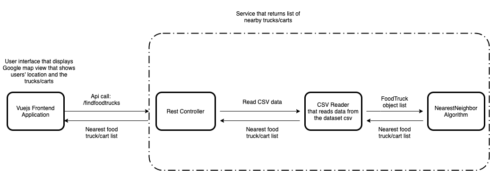

# MobileFoodFacility

The Mobile Food Facility is a simple web application that displays nearby Food trucks and Food carts at your location.
The application displays minimum 5 or more nearby trucks/carts based on the latitude and longitude of the position you are in.

#### Setup

The application contains a frontend client and a backend service. 

The frontend client is a VueJs application that displays a map view backed by google maps api from VueGoogleMaps npm package.

We can simulate our location change by clicking anywhere on the map and the nearby trucks/carts should be shown accordingly.

The backend service is a SpringBoot application that exposes an api that takes users latitude/longitude and the minimum count of trucks/carts and returns 
a list of nearby food trucks/carts in JSON format.

The application is run on localhost.

Format: 

#### Using Docker

* Install Docker in your machine with the CLI for docker.
* To build the images, goto the project folder and run: 
           
        docker-compose build
* Building images will create images app-service and app-client in docker.
* To execute the images in containers execute:

        docker-compose up
* Once build and execution succeeds goto:

        http://localhost:8081/
* Backend is run on: 

        # eg: http://localhost:8080/findfoodtrucks?lat=37.792252&lng=-122.403793&count=10
        http://localhost:8080
       

#### Using command line

* Install maven and npm in your machine and their CLI.
* Download the source code.
* Goto the project folder and execute the following to build and run the backend:
        
        # build service
        mvn clean package
        
        # service is executed on localhost:8080
        java -jar $(pwd)/service/target/service-1.0.0-SNAPSHOT.jar
        
        # you can test the service by calling the api, by changing latitude and longitude values in San Francisco region 
        # and the minimum count
        http://localhost:8080/findfoodtrucks?lat=37.792252&lng=-122.403793&count=10
        
* Goto the project folder to run the frontend as below:

        cd user-interface
        
        # build and download dependencies
        npm clean install
        
        # execute client
        npm serve
        
        # can load client by executing
        http://localhost:8081/
        
        cd ../
        
#### Running tests

          # build tests and run tests
          mvn clean test
         
### TroubleShooting      

* Make sure you are not in any vpn, as npm install might fail due to timeout.
* Confirm that .npmrc file has proper registry urls. eg: https://registry.npmjs.com/
* Make sure you free up ports 8080 and 8081 for the applications to run.
